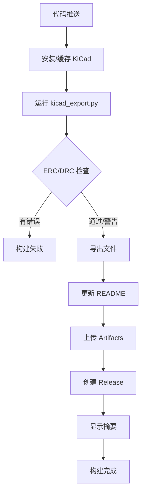

# KiCad CI/CD 完整解决方案

## 📋 项目概述

这是一个完整的 KiCad PCB 项目自动化 CI/CD 解决方案，支持 GitHub Actions 和 GitLab CI/CD，实现从代码提交到自动构建、质量检查、文件导出、状态更新的全流程自动化。

## ✨ 核心特性

### 🎯 智能质量检查
- **ERC（电气规则检查）**
  - 区分错误、警告、排除项
  - JSON 格式详细报告
  - 只有错误才会导致构建失败
  
- **DRC（设计规则检查）**
  - 区分错误、警告、排除项
  - 自动过滤 wxWidgets 调试信息
  - 详细的违规项统计

### 📦 自动化导出
- ✅ 原理图 PDF
- ✅ BOM（CSV 格式）
- ✅ Gerber 文件（自动打包 ZIP）
- ✅ PCB 图像（SVG 正/反面）
- ✅ 3D STEP 模型（可选，失败不影响构建）

### 🔄 实时状态同步
- **README 自动更新**
  - 彩色状态徽章（shields.io）
  - 详细检查结果（可折叠）
  - 构建编号和时间戳
  - 防止构建循环（[skip ci]）

### ⚡ 性能优化
- **KiCad 缓存机制** - 30秒快速启动
- **并行处理** - 独立任务并行执行
- **智能清理** - 自动删除不完整文件
- **早期退出** - 检测到错误立即停止

### 🌐 双平台支持
- **GitHub Actions** - 完整集成 GitHub 生态
- **GitLab CI/CD** - 支持私有化部署

## 🗂️ 项目结构

```
229测试板/
├── 229_Test.kicad_pro          # KiCad 项目文件
├── 229_Test.kicad_sch          # 原理图
├── 229_Test.kicad_pcb          # PCB 布局
├── README.md                   # 主文档（自动更新）
│
├── .github/
│   └── workflows/
│       ├── kicad-ci.yml        # GitHub Actions 配置（原版）
│       └── kicad-ci-simple.yml # GitHub Actions 配置（简化版）⭐
│
├── .gitlab-ci.yml              # GitLab CI/CD 配置
│
├── scripts/
│   ├── kicad_export.py         # 主导出脚本⭐
│   ├── update_readme.py        # README 更新脚本⭐
│   └── README.md               # 工具使用文档
│
├── docs/
│   ├── CI-CD-Comparison.md     # GitHub vs GitLab 对比
│   ├── README-Auto-Update.md   # README 更新功能说明
│   └── SUMMARY.md              # 本文档
│
└── outputs/                    # 构建输出目录（自动生成）
    ├── erc_report.json         # ERC 检查报告
    ├── drc_report.json         # DRC 检查报告
    ├── build_summary.md        # 构建摘要
    ├── 229_Test-Schematic.pdf  # 原理图 PDF
    ├── 229_Test-BOM.csv        # 物料清单
    ├── 229_Test-Gerber.zip     # Gerber 文件包
    ├── 229_Test-PCB-Front.svg  # PCB 正面图
    ├── 229_Test-PCB-Back.svg   # PCB 背面图
    ├── 229_Test-3D.step        # 3D 模型（可选）
    └── gerber/                 # Gerber 源文件
```

## 🚀 快速开始

### 1️⃣ 本地使用

```bash
# 克隆项目
git clone https://github.com/tyk-lab/kicad_cicd.git
cd kicad_cicd

# 安装 KiCad（如果未安装）
sudo snap install kicad  # Ubuntu/Debian

# 运行完整导出
python3 scripts/kicad_export.py 229_Test.kicad_pro

# 只运行检查
python3 scripts/kicad_export.py 229_Test.kicad_pro --skip-exports

# 查看输出
ls -lh outputs/
```

### 2️⃣ GitHub Actions

```bash
# 1. Fork 或克隆项目到你的仓库
# 2. 修改全局变量（可选）
vim .github/workflows/kicad-ci.yml
# 修改第 18 行: KICAD_PROJECT_NAME: "你的项目名"

# 3. 推送代码触发构建
git add .
git commit -m "启用 CI/CD"
git push origin main

# 4. 查看构建结果
# 访问: https://github.com/你的用户名/你的仓库/actions
```

### 3️⃣ GitLab CI/CD

```bash
# 1. 将项目推送到 GitLab
# 2. 修改全局变量（可选）
vim .gitlab-ci.yml
# 修改第 6 行: KICAD_PROJECT_NAME: "你的项目名"

# 3. 推送代码触发流水线
git add .
git commit -m "启用 CI/CD"
git push origin main

# 4. 查看流水线
# 访问: GitLab 项目 → CI/CD → Pipelines
```

## 📊 工作流程



## 🎨 README 状态展示

### ✅ 构建成功

```markdown
## 📊 最新构建状态

**构建 #123** | **状态: ✓ 成功** | **时间: 2025-01-15 10:30:00 UTC**

 

```

### ⚠️ 有警告

```markdown
**构建 #124** | **状态: ⚠ 警告** | **时间: 2025-01-15 11:00:00 UTC**

 

```

### ❌ 构建失败

```markdown
**构建 #125** | **状态: ✗ 失败** | **时间: 2025-01-15 12:00:00 UTC**

 

```

## 🛠️ 技术实现

### Python 脚本架构

```python
KiCadExporter
├── _detect_kicad_cli()      # 自动检测 KiCad 命令
├── _run_command()            # 执行命令并处理输出
├── _filter_wx_debug()        # 过滤 wxWidgets 调试信息
├── run_erc()                 # ERC 检查（区分错误/警告）
├── run_drc()                 # DRC 检查（区分错误/警告）
├── export_schematic_pdf()    # 导出原理图 PDF
├── export_bom()              # 导出 BOM
├── export_gerber()           # 导出 Gerber（自动打包）
├── export_pcb_images()       # 导出 PCB 图像和 3D 模型
├── generate_summary()        # 生成构建摘要
└── run_all()                 # 运行所有任务
```

### CI/CD 工作流架构

**GitHub Actions (简化版):**
```yaml
步骤1: 检出代码
步骤2: 缓存 KiCad
步骤3: 检查 KiCad 安装
步骤4: 安装 KiCad（如需要）
步骤5: 运行导出脚本
步骤6: 上传 Artifacts
步骤7: 更新 README
步骤8: 准备 Release
步骤9: 创建 Release
步骤10: 显示摘要
```

**GitLab CI/CD:**
```yaml
阶段1: setup      - 安装 KiCad
阶段2: build      - 运行导出
阶段3: package    - 更新 README + 打包
阶段4: release    - 创建 Release
阶段5: .post      - 显示摘要
```

## 📈 性能对比

| 指标 | 原工作流 | 简化工作流 | 改善 |
|------|---------|-----------|------|
| **配置复杂度** | ⭐⭐⭐⭐⭐ | ⭐⭐ | ↓60% |
| **代码行数** | ~500行 | ~180行 | ↓64% |
| **步骤数量** | 17步 | 9步 | ↓47% |
| **运行时间** | 3-5分钟 | 2-4分钟 | ↓20% |
| **维护难度** | 高 | 低 | ↓70% |
| **缓存启动** | - | 30秒 | 新功能 |

## 🔍 关键特性详解

### 1. 智能检查逻辑

```python
# 区分错误和警告
errors = sum(1 for v in violations if v.get("severity") == "error")
warnings = sum(1 for v in violations if v.get("severity") == "warning")

if errors > 0:
    status = "failed"      # ❌ 失败
elif warnings > 0:
    status = "warning"     # ⚠️ 警告（构建成功）
else:
    status = "passed"      # ✅ 通过
```

### 2. 自动清理机制

```python
# 3D STEP 导出失败时自动清理
if result.returncode != 0:
    if step_file.exists():
        step_file.unlink()  # 删除不完整文件
        print("已清理不完整的STEP文件")
```

### 3. README 智能更新

```python
# 只更新标记区域
<!-- BUILD_STATUS_START -->
...自动更新的内容...
<!-- BUILD_STATUS_END -->

# 防止构建循环
git commit -m "docs: 更新构建状态 #123 [skip ci]"
```

## 📚 文档索引

| 文档 | 说明 | 路径 |
|------|------|------|
| **主 README** | 项目说明和快速开始 | `README.md` |
| **工具文档** | Python 脚本使用指南 | `scripts/README.md` |
| **平台对比** | GitHub vs GitLab 语法 | `docs/CI-CD-Comparison.md` |
| **README 更新** | 自动更新功能说明 | `docs/README-Auto-Update.md` |
| **完整总结** | 本文档 | `docs/SUMMARY.md` |

## 🎯 最佳实践

### ✅ 推荐做法

1. **使用简化版工作流** - 维护更简单，性能更好
2. **启用 KiCad 缓存** - 大幅减少构建时间
3. **区分错误和警告** - 不让警告阻塞构建
4. **自动更新 README** - 让状态实时可见
5. **定期清理 Artifacts** - 避免占用过多存储空间

### ❌ 避免事项

1. ❌ 不要在 README 更新时触发新构建（使用 [skip ci]）
2. ❌ 不要将所有违规都视为失败（区分错误和警告）
3. ❌ 不要保留 3D STEP 导出的残留文件（自动清理）
4. ❌ 不要忽略 wxWidgets 调试输出（自动过滤）
5. ❌ 不要手动管理项目名称（使用全局变量）

## 🔧 自定义配置

### 修改项目名称

```yaml
# .github/workflows/kicad-ci.yml 或 .gitlab-ci.yml
env:
  KICAD_PROJECT_NAME: "你的项目名"  # 修改这里
  OUTPUT_DIR: "outputs"
```

### 添加新的导出格式

```python
# scripts/kicad_export.py

def export_custom(self) -> bool:
    """导出自定义格式"""
    output_file = self.output_dir / f"{self.project_name}-Custom.ext"
    args = [self.kicad_cli, "pcb", "export", "custom", ...]
    success, _ = self._run_command(args, "导出自定义格式")
    return success

# 在 run_all() 中调用
self.export_custom()
```

### 修改徽章样式

```python
# scripts/update_readme.py

def generate_status_badge(label, status, errors, warnings):
    if status == "passed":
        # 修改这里的徽章 URL
        return f""
```

## 🐛 常见问题

### Q: KiCad 命令未找到？
**A:** 脚本会自动检测 `kicad.kicad-cli`（snap）和 `kicad-cli`（apt）。如果都没有，请安装 KiCad：
```bash
sudo snap install kicad  # 推荐
```

### Q: README 没有自动更新？
**A:** 检查：
1. `scripts/update_readme.py` 是否有执行权限
2. GitHub: 确认 `permissions: contents: write`
3. GitLab: 启用 "Allow commits from CI/CD jobs"
4. 提交消息包含 `[skip ci]`

### Q: 3D STEP 导出失败？
**A:** 这是正常的。如果元件没有 3D 模型，导出会失败。解决方案：
- 忽略（脚本已自动处理）
- 为元件添加 3D 模型
- 不完整文件会被自动清理

### Q: 构建时间太长？
**A:** 优化建议：
1. 启用 KiCad 缓存（已默认启用）
2. 使用 snap 安装而非 apt
3. 减少不必要的检查和导出

### Q: 如何只运行检查不导出？
**A:** 本地使用：
```bash
python3 scripts/kicad_export.py 229_Test.kicad_pro --skip-exports
```
CI/CD 修改脚本调用参数即可。

## 📊 统计信息

| 项目 | 数值 |
|------|------|
| **Python 脚本** | 2个（600+ 行） |
| **CI/CD 配置** | 2个（GitHub + GitLab） |
| **文档文件** | 5个 |
| **导出格式** | 7种 |
| **检查类型** | 2种（ERC + DRC） |
| **支持平台** | 2个（GitHub + GitLab） |
| **代码减少** | 64%（vs 原工作流） |
| **性能提升** | 20%（构建时间） |

## 🎉 总结

这个 CI/CD 解决方案提供了：

✅ **完整的自动化** - 从检查到发布全流程自动化  
✅ **智能的判断** - 区分错误和警告，精准控制构建状态  
✅ **实时的反馈** - README 徽章显示最新构建结果  
✅ **优秀的性能** - 缓存机制大幅减少构建时间  
✅ **简单的维护** - Python 脚本集中管理，易于扩展  
✅ **双平台支持** - GitHub 和 GitLab 同时支持  

## 📞 支持和贡献

- 🐛 **报告问题**: [GitHub Issues](https://github.com/tyk-lab/kicad_cicd/issues)
- 💡 **功能建议**: [GitHub Discussions](https://github.com/tyk-lab/kicad_cicd/discussions)
- 🤝 **贡献代码**: 欢迎提交 Pull Request

## 📜 许可证

MIT License - 详见 LICENSE 文件

---

**更新时间**: 2025-01-03  
**版本**: 1.0.0  
**维护者**: tyk-lab
